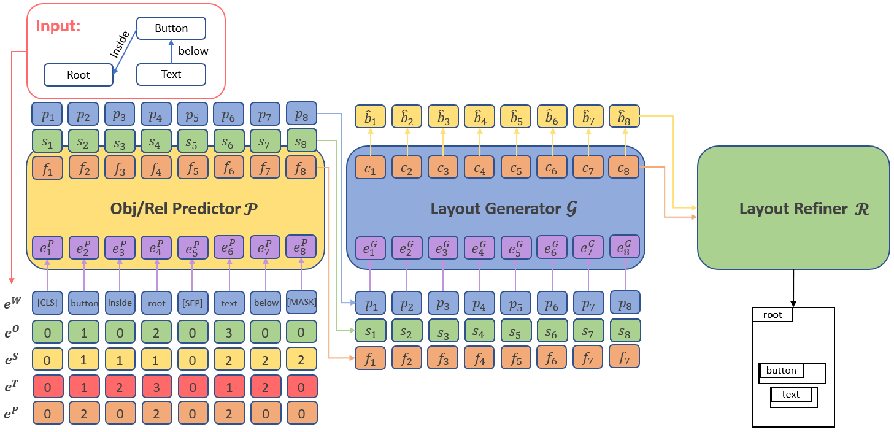

# GUILGET: GUI Layout GEneration with Transformer

Pytorch implementation for GUILGET. The goal is to generate scene layout with conceptual and spatial diversity.

### Overview



### Data
- Please setup conda envirnment first by following command.
    - Create conda env
```
conda create -n guilget python=3.7
conda activate guilget
```
    - Install pip packages
```
pip install -r requirements.txt 
```

### Data
- CLAY dataset
    - Download the screen annotations from [RICO](http://interactionmining.org/rico).
    - i.e., UI Screenshots and View Hierarchies [6GB]
    - Extract the screen annotations to `data/screenshots/`
    - Download the clay dataset from [CLAY](https://github.com/google-research-datasets/clay.git).
    - Extract all files from it to `data/clay/`
    - Generate scene graphs from anotations:
    ```
    python utils/build_clay.py
    ```
    - Generate statistics for GMM:
    ```
    python loader/CLAYDataset.py
    ```

### Training
All code was developed and tested on Fedora release 36 with Python 3.7 (Anaconda) and PyTorch 1.9.0.

#### Pre-train the Obj/Rel Rredictor
- Pre-train Predictor:
```
python train.py --cfg_path ./configs/clay/clay_pretrain_all.yaml
```
#### Full module
- Train full model:
```
python train.py --cfg_path ./configs/clay/clay_seq2seq_all.yaml
```

`*.yml` files include configuration for training and testing.

> Please note that you might need to modify the config file to fit the corresponding path on your device if the data is placed in other places.

### Evaluation

#### GUILGET full model   
- Evaluate full model:
```
python train.py --cfg_path [PATH_TO_CONFIG_FILE] --checkpoint [PATH_TO_THE_WEIGHT_FOR_GUILGET] --eval_only
```
For example,
```
python train.py --cfg_path configs/clay/clay_seq2seq_all.yaml --checkpoint ./experiments/clay_seq2seq_all/checkpoint_50_0.09892113760714498.pth --eval_only
```

### Citation

If you find this useful for your research, please use the following.

```
@InProceedings{,
    author    = {},
    title     = {GUILGET: GUI Layout GEneration with Transformer},
    booktitle = {},
    month     = {},
    year      = {2023},
    pages     = {}
}
```

### Acknowledgements
This code borrows heavily from [Transformer](https://github.com/pytorch/pytorch/blob/master/torch/nn/modules/transformer.py) repository and from [LayoutTransformer](https://github.com/davidhalladay/LayoutTransformer). Many thanks.
